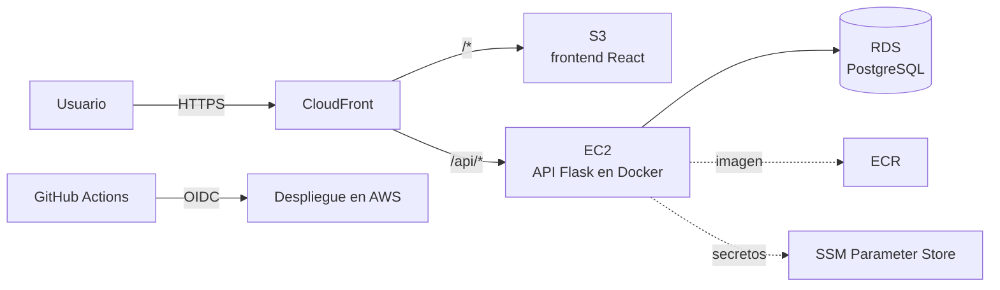

# Job Tracker

Aplicación web para registrar y dar seguimiento a postulaciones de empleo y prácticas, con estadísticas para medir la efectividad de la búsqueda.

> 🚧 **En construcción.** Fase actual: **0 · Diseño**. Avance en el [roadmap](ROADMAP.md).

## Funcionalidades (MVP)

- Registrar postulaciones: empresa, puesto, estado, fecha, enlace, fuente y notas.
- Lista con búsqueda, filtros por estado y fecha, orden y paginación.
- Editar y eliminar postulaciones.
- Estadísticas: total, distribución por estado, postulaciones por mes, tasa de respuesta y tasa de entrevistas.

## Stack

| Capa | Tecnologías |
|---|---|
| Frontend | React, TypeScript, Vite, Recharts |
| Backend | Python, Flask, SQLAlchemy, Alembic, Pydantic, Gunicorn |
| Base de datos | PostgreSQL |
| Pruebas | pytest, Vitest, React Testing Library, Playwright |
| Calidad | Ruff, ESLint, SonarQube Cloud |
| Contenedores | Docker, Docker Compose |
| CI/CD | GitHub Actions (OIDC hacia AWS) |
| Infraestructura | Terraform, AWS (CloudFront, S3, EC2, RDS, ECR, SSM) |

## Arquitectura planeada



El navegador habla con un solo dominio: CloudFront entrega el frontend y redirige `/api/*` a la API, así que no se necesita CORS. La infraestructura se crea y destruye con Terraform. Los detalles están en las [decisiones de diseño](docs/05-decisiones.md).

## Estructura del repositorio

```
job-tracker/
├── backend/             # API en Flask
├── frontend/            # React + TypeScript
├── e2e/                 # Pruebas de navegador con Playwright
├── infra/               # Infraestructura en AWS con Terraform
├── docs/                # Diseño del proyecto
└── .github/             # Workflows de CI/CD y plantillas
```

## Documentación de diseño

1. [Requisitos e historias de usuario](docs/01-requisitos.md)
2. [Modelo de datos](docs/02-modelo-de-datos.md)
3. [API REST](docs/03-api.md)
4. [Pantallas](docs/04-pantallas.md)
5. [Decisiones de diseño (ADR)](docs/05-decisiones.md)

## Cómo correrlo localmente

Disponible a partir de la Fase 3, cuando todo el sistema se levante con `docker compose up`.

## Licencia

[MIT](LICENSE)
