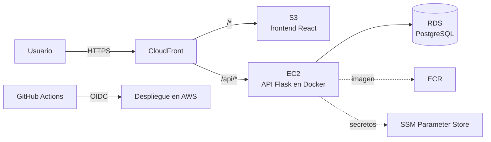

# Job Tracker

Aplicación web para registrar y dar seguimiento a postulaciones de empleo y prácticas, con estadísticas para medir la efectividad de la búsqueda.

> 🚧 **En construcción.** La aplicación completa ya corre en Docker; fase actual: **4 · CI y calidad**. Avance en el [roadmap](ROADMAP.md).

## Funcionalidades (MVP)

- Registrar postulaciones: empresa, puesto, estado, fecha, enlace, fuente y notas.
- Lista con búsqueda, filtros por estado y fecha, orden y paginación.
- Editar y eliminar postulaciones.
- Estadísticas: total, distribución por estado, postulaciones por mes, tasa de respuesta y tasa de entrevistas.

## Stack

| Capa | Tecnologías |
|---|---|
| Frontend | React, TypeScript, Vite, React Router, TanStack Query, CSS Modules |
| Backend | Python, Flask, SQLAlchemy, Alembic, Pydantic, Gunicorn |
| Base de datos | PostgreSQL |
| Pruebas | pytest, Vitest, React Testing Library, Playwright |
| Calidad | Ruff, ESLint, Prettier, SonarQube Cloud |
| Contenedores | Docker, Docker Compose, Nginx |
| CI/CD | GitHub Actions (OIDC hacia AWS) |
| Infraestructura | Terraform, AWS (CloudFront, S3, EC2, RDS, ECR, SSM) |

## Arquitectura planeada



El navegador habla con un solo dominio: CloudFront entrega el frontend y redirige `/api/*` a la API, así que no se necesita CORS. La infraestructura se crea y destruye con Terraform. Los detalles están en las [decisiones de diseño](docs/05-decisiones.md).

## Estructura del repositorio

```
job-tracker/
├── backend/             # API en Flask (ver su README)
├── frontend/            # Interfaz en React + TypeScript (ver su README)
├── e2e/                 # Pruebas de navegador con Playwright
├── infra/               # Infraestructura en AWS con Terraform
├── docs/                # Diseño del proyecto
├── docker/              # Scripts de arranque de la base de datos
├── docker-compose.yml   # Toda la app en Docker: base de datos, API y frontend
└── .github/             # Workflows de CI/CD y plantillas
```

## Documentación de diseño

1. [Requisitos e historias de usuario](docs/01-requisitos.md)
2. [Modelo de datos](docs/02-modelo-de-datos.md)
3. [API REST](docs/03-api.md)
4. [Pantallas](docs/04-pantallas.md)
5. [Decisiones de diseño (ADR)](docs/05-decisiones.md)
6. [Docker](docs/06-docker.md)

## Cómo correrlo localmente

Solo necesitas Docker Desktop:

```bash
cp .env.example .env
docker compose up -d                 # base de datos, migraciones, API y frontend
docker compose exec api flask seed   # opcional: 30 postulaciones de ejemplo
```

Abre `http://localhost:8080`. La guía completa, con los comandos para ver logs, apagar y resolver problemas, está en [docs/06-docker.md](docs/06-docker.md).

Para programar con recarga automática al guardar, se usa el modo desarrollo: la base en Docker (`docker compose up -d db`), la API con `flask run` y el frontend con `npm run dev` (pasos en [backend/README.md](backend/README.md) y [frontend/README.md](frontend/README.md)).

En los dos modos el navegador habla con un solo origen: Nginx (en Docker) o Vite (en desarrollo) reenvían `/api` a la API, así que no hace falta CORS.

Resumen de la API (detalle en [docs/03-api.md](docs/03-api.md)):

| Método | Ruta | Descripción |
|---|---|---|
| `GET` | `/api/v1/health` | Estado de la API y la base de datos |
| `GET` | `/api/v1/applications` | Lista con filtros, orden y paginación |
| `POST` | `/api/v1/applications` | Crear una postulación |
| `GET` | `/api/v1/applications/{id}` | Obtener una postulación |
| `PATCH` | `/api/v1/applications/{id}` | Modificar algunos campos |
| `DELETE` | `/api/v1/applications/{id}` | Eliminar |
| `GET` | `/api/v1/stats` | Estadísticas |

## Licencia

[MIT](LICENSE)
