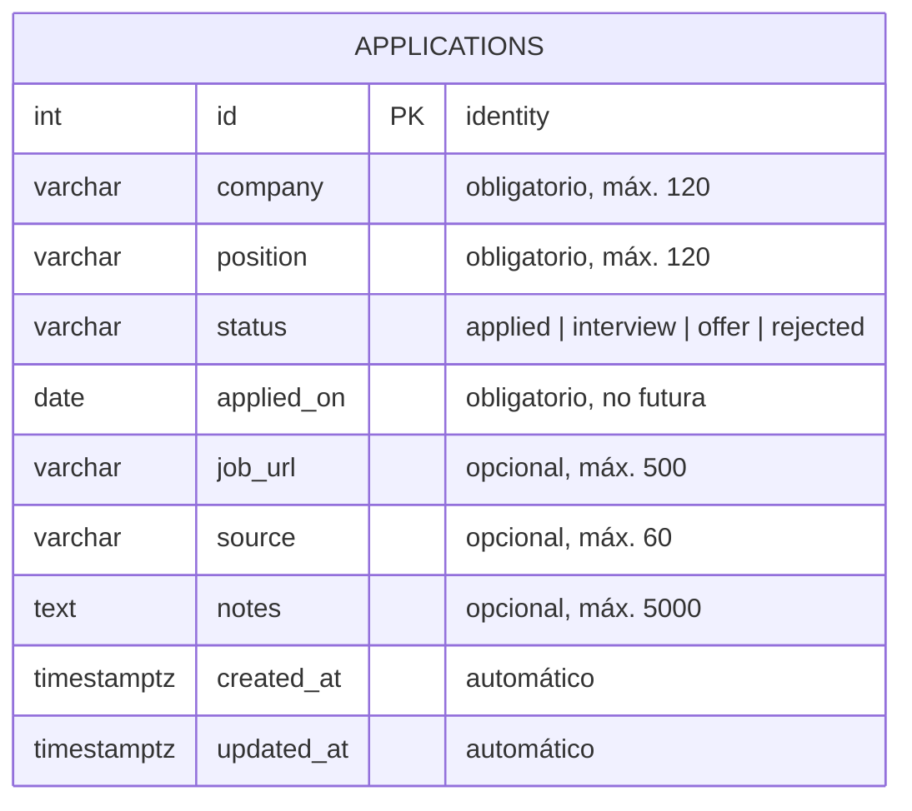

# 2. Modelo de datos

El MVP necesita una sola tabla: `applications`. Los nombres de tablas y columnas están en inglés, que es la convención en la industria.

## Diagrama



## Columnas

| Columna | Tipo | Nulo | Valor por defecto | Reglas |
|---|---|---|---|---|
| `id` | `INTEGER` (identity) | No | Autoincremental | Llave primaria |
| `company` | `VARCHAR(120)` | No | — | Sin espacios al inicio/fin; no vacía |
| `position` | `VARCHAR(120)` | No | — | Sin espacios al inicio/fin; no vacía |
| `status` | `VARCHAR(20)` | No | `'applied'` | Uno de: `applied`, `interview`, `offer`, `rejected` |
| `applied_on` | `DATE` | No | Fecha actual | No puede ser futura (se valida en la API) |
| `job_url` | `VARCHAR(500)` | Sí | — | URL `http://` o `https://` |
| `source` | `VARCHAR(60)` | Sí | — | Texto libre: OCC, LinkedIn, referido… |
| `notes` | `TEXT` | Sí | — | Máximo 5000 caracteres (se valida en la API) |
| `created_at` | `TIMESTAMPTZ` | No | `now()` | Se asigna al crear |
| `updated_at` | `TIMESTAMPTZ` | No | `now()` | La aplicación lo actualiza en cada cambio |

## SQL de referencia

En el proyecto la tabla **no se crea a mano**: la crea una migración de Flask-Migrate (Alembic) a partir del modelo de SQLAlchemy. Este SQL sirve como referencia de lo que debe resultar.

```sql
CREATE TABLE applications (
    id          INTEGER GENERATED BY DEFAULT AS IDENTITY PRIMARY KEY,
    company     VARCHAR(120) NOT NULL,
    position    VARCHAR(120) NOT NULL,
    status      VARCHAR(20)  NOT NULL DEFAULT 'applied',
    applied_on  DATE         NOT NULL DEFAULT CURRENT_DATE,
    job_url     VARCHAR(500),
    source      VARCHAR(60),
    notes       TEXT,
    created_at  TIMESTAMPTZ  NOT NULL DEFAULT now(),
    updated_at  TIMESTAMPTZ  NOT NULL DEFAULT now(),

    CONSTRAINT ck_applications_status
        CHECK (status IN ('applied', 'interview', 'offer', 'rejected')),
    CONSTRAINT ck_applications_company_not_blank
        CHECK (length(trim(company)) > 0),
    CONSTRAINT ck_applications_position_not_blank
        CHECK (length(trim(position)) > 0)
);

CREATE INDEX ix_applications_status     ON applications (status);
CREATE INDEX ix_applications_applied_on ON applications (applied_on DESC);
```

### ¿Por qué estos índices?

- `status`: la lista se filtra por estado y las estadísticas agrupan por estado.
- `applied_on`: el orden por defecto de la lista y las estadísticas por mes usan esta columna.

Con pocas filas PostgreSQL ni siquiera los usará, pero es la práctica correcta y un buen tema para explicar en una entrevista.

## Validación en dos capas

| Regla | API (Pydantic) | Base de datos |
|---|---|---|
| Campos obligatorios | ✅ | ✅ `NOT NULL` |
| Longitud máxima | ✅ | ✅ `VARCHAR(n)` |
| Estado válido | ✅ | ✅ `CHECK` |
| Empresa/puesto no vacíos | ✅ | ✅ `CHECK` |
| Fecha no futura | ✅ | — (depende del día, no se pone en la BD) |
| URL válida | ✅ | — |
| Notas ≤ 5000 caracteres | ✅ | — |

La API da mensajes claros al usuario; la base de datos es la última defensa para que nunca entren datos inválidos, aunque alguien los inserte sin pasar por la API.

## Consultas que usará la aplicación

Lista con filtros (ejemplo: estado "Entrevista", búsqueda "data", página 1):

```sql
SELECT *
FROM applications
WHERE status = 'interview'
  AND (company ILIKE '%data%' OR position ILIKE '%data%')
ORDER BY applied_on DESC, id DESC
LIMIT 20 OFFSET 0;
```

> Se agrega `id DESC` como segundo criterio para que el orden sea estable cuando varias postulaciones tienen la misma fecha; sin eso, la paginación podría repetir o saltarse filas.

Estadísticas por estado:

```sql
SELECT status, COUNT(*) AS total
FROM applications
GROUP BY status;
```

Estadísticas por mes:

```sql
SELECT to_char(date_trunc('month', applied_on), 'YYYY-MM') AS month,
       COUNT(*) AS total
FROM applications
GROUP BY 1
ORDER BY 1;
```

En el código estas consultas se escriben con SQLAlchemy, pero conviene que puedas escribirlas también en SQL puro.

## Limitación conocida

Solo se guarda el **estado actual**. Si una postulación pasó por *Entrevista* y luego quedó *Rechazado*, ya no se sabe que tuvo entrevista. La mejora natural es una tabla `status_changes` (historial), fuera del alcance del MVP.
