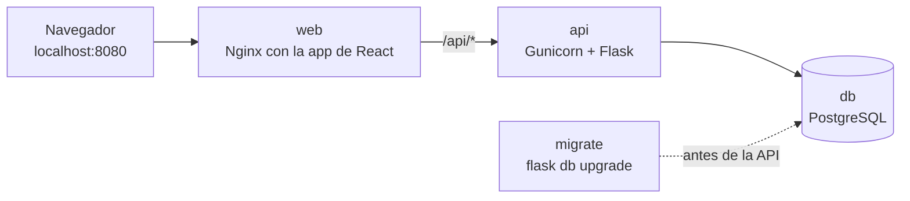

# 6. Docker

Con Docker Compose, toda la aplicación (base de datos, API y frontend) se levanta con un solo comando, igual en cualquier computadora y como funcionará en producción.

## Los servicios



| Servicio | Imagen | Qué hace | Puerto en tu computadora |
|---|---|---|---|
| `db` | `postgres:16-alpine` | Guarda los datos en el volumen `db-data` | `5432` |
| `migrate` | `job-tracker-api` | Aplica las migraciones pendientes y termina | — |
| `api` | `job-tracker-api` (se construye con `backend/Dockerfile`) | La API con Gunicorn | — (se llega por Nginx) |
| `web` | `job-tracker-web` (se construye con `frontend/Dockerfile`) | Sirve la app y reenvía `/api/*` a la API | `8080` |

Arrancan en este orden; cada uno espera al anterior:

1. `db` hasta que está **healthy** (acepta conexiones).
2. `migrate` hasta que **termina sin errores**.
3. `api` hasta que está **healthy** (responde `GET /api/v1/health`).
4. `web`.

## Levantar todo

Requisito: Docker Desktop abierto. Todos los comandos van en la terminal de Ubuntu, en la raíz del proyecto.

```bash
cd ~/proyectos/job-tracker
[ -f .env ] || cp .env.example .env   # crea .env solo si aún no existe
docker compose up -d          # la primera vez tarda unos minutos: descarga y construye
docker compose ps             # api y web deben decir "healthy"
```

Abre `http://localhost:8080`.

Si la base está vacía, carga los datos de ejemplo:

```bash
docker compose exec api flask seed
```

Cada `docker compose up -d` vuelve a construir las imágenes de la API y del frontend con tu código actual. Gracias a la caché de Docker, si nada cambió tarda unos segundos.

## Comandos útiles

| Comando | Qué hace |
|---|---|
| `docker compose ps` | Estado de los servicios encendidos |
| `docker compose ps -a` | Incluye los que ya terminaron, como `migrate` |
| `docker compose logs -f api` | Sigue los logs de la API (`Ctrl + C` para salir) |
| `docker compose logs migrate` | Muestra qué hicieron las migraciones |
| `docker compose exec api flask seed --reset` | Borra las postulaciones y carga 30 de ejemplo |
| `docker compose exec db psql -U jobtracker` | Abre una consola de SQL en la base (`\q` para salir) |
| `docker compose down` | Apaga todo; los datos se conservan |
| `docker compose down -v` | Apaga todo y **borra los datos** |

## Docker o modo desarrollo

Hay dos formas de correr el proyecto. Las dos usan el mismo contenedor de base de datos y los mismos datos.

| | Docker (`docker compose up -d`) | Desarrollo (`flask run` + `npm run dev`) |
|---|---|---|
| Para qué | Probar todo como en producción | Programar |
| Dirección | `http://localhost:8080` | `http://localhost:5173` |
| Al guardar un archivo | Hay que volver a correr `docker compose up -d` | Se recarga solo |
| Servidor de la API | Gunicorn | Servidor de desarrollo de Flask |
| Quién reenvía `/api` | Nginx | El proxy de Vite |

Se pueden tener las dos encendidas al mismo tiempo porque usan puertos distintos.

## Recorrido de una petición

Al abrir la lista de postulaciones en `http://localhost:8080`:

1. **Nginx** (`web`) entrega `index.html`, el JavaScript y el CSS que compiló Vite.
2. La app pide `GET /api/v1/applications`. Va al **mismo** origen (`localhost:8080`), así que no hace falta CORS.
3. Nginx ve que la ruta empieza con `/api/` y la reenvía al servicio `api`. Dentro de la red de Docker, cada servicio se encuentra por su nombre, como si fuera el nombre de una computadora.
4. **Gunicorn** pasa la petición a uno de sus procesos de Flask, que consulta a `db` y responde JSON.

En AWS (Fase 5), CloudFront hará el papel de Nginx y la base será RDS, pero la imagen de la API será la misma.

## Qué hace cada archivo

| Archivo | Para qué sirve |
|---|---|
| `docker-compose.yml` | Define los cuatro servicios, sus variables, dependencias y puertos |
| `backend/Dockerfile` | Imagen de la API: instala dependencias, copia el código y arranca Gunicorn como un usuario sin privilegios |
| `backend/gunicorn.conf.py` | Puerto, número de procesos, tiempos límite y logs de Gunicorn |
| `frontend/Dockerfile` | Dos etapas: compila la app con Node y copia el resultado a Nginx |
| `frontend/nginx/default.conf.template` | Configuración de Nginx: rutas de la app, reenvío de `/api`, caché, compresión y cabeceras de seguridad |
| `backend/.dockerignore`, `frontend/.dockerignore` | Lo que nunca debe entrar a una imagen: `.env`, `.venv`, `node_modules`, pruebas |

Las decisiones detrás de estos archivos están en los [ADR-014 y ADR-015](05-decisiones.md#adr-014-imágenes-de-docker-pequeñas-y-sin-privilegios).

## Seguridad

- La API y Nginx **no corren como root**, y el código dentro de las imágenes es de solo lectura para ellos.
- La API no se publica en tu computadora: solo Nginx puede llegar a ella.
- Los puertos se abren solo en `127.0.0.1`, así que otras computadoras de tu red no pueden entrar.
- Nginx envía cabeceras de seguridad, entre ellas una política de contenido (CSP) que solo permite scripts y estilos del propio sitio.
- `.env` nunca entra a una imagen. Las variables llegan al contenedor desde `docker-compose.yml`.

## Problemas comunes

| Síntoma | Solución |
|---|---|
| `Cannot connect to the Docker daemon` o `failed to connect to the docker API` | Docker Desktop está cerrado. Ábrelo y espera a que diga que está corriendo. |
| `port is already allocated` en el `8080` | Otro programa usa ese puerto. Cambia `WEB_PORT` en `.env` (por ejemplo a `8081`) y abre esa dirección. |
| `service "migrate" didn't complete successfully: exit 1` | Falló una migración. Revisa el error con `docker compose logs migrate`. |
| `dependency failed to start: container job-tracker-api-1 is unhealthy` | La API arrancó pero no responde. Revisa `docker compose logs api`; casi siempre es la conexión a la base. |
| La app dice "La API no respondió" | La API está apagada o reiniciándose. Revisa `docker compose ps` y `docker compose logs api`. |
| No ves tus últimos cambios | Corre otra vez `docker compose up -d` y recarga el navegador con `Ctrl + Shift + R`. |
| Docker ocupa mucho espacio | `docker system df` muestra cuánto usa; `docker image prune` borra las imágenes viejas que ya no se usan. |
