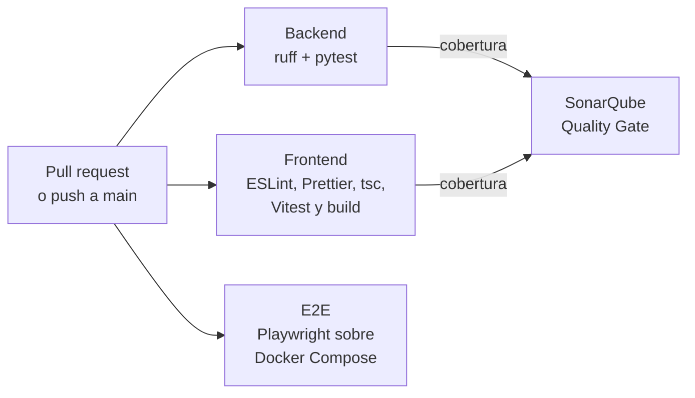

# 7. Integración continua (CI)

Cada pull request pasa por una revisión automática en GitHub Actions. Si algo falla, GitHub no deja unirlo a `main`. El workflow está en [`.github/workflows/ci.yml`](../.github/workflows/ci.yml).

## Qué se revisa



| Job | Qué hace | Falla si… |
|---|---|---|
| **Backend** | Instala las dependencias, corre `ruff check` y `ruff format --check`, y luego `pytest` contra un PostgreSQL temporal | Hay errores de estilo o de formato, falla una prueba o la cobertura baja de 80 % |
| **Frontend** | Corre ESLint, Prettier, la revisión de tipos de TypeScript, Vitest con cobertura y compila la app | Cualquiera de esos pasos marca un error |
| **E2E** | Levanta la app con `docker compose up -d` y corre las pruebas de Playwright en Chromium | Una imagen no se construye, la app no arranca o falla una prueba de navegador |
| **SonarQube** | Analiza el código con los reportes de cobertura del Backend y del Frontend y espera el Quality Gate | El código nuevo no pasa el Quality Gate |

Backend, Frontend y E2E corren al mismo tiempo; SonarQube espera a los dos primeros. Una ejecución completa tarda unos minutos; la más lenta es E2E, porque construye las imágenes de Docker.

## Cuando algo falla

1. En el pull request, junto al check en rojo, haz clic en **Details**.
2. Abre el paso marcado con ❌ para ver el error. ruff marca la línea exacta en la pestaña **Files changed** del pull request.
3. Si falló **E2E**, al final de la página de la ejecución, en **Artifacts**, descarga `reporte-playwright`. Ábrelo con `npx playwright show-report <carpeta>` desde `e2e/`: trae capturas y un *trace* paso a paso de la prueba que falló.
4. Corrige, haz commit y push a la misma rama. La CI vuelve a correr sola.

## Correr lo mismo en tu computadora

Antes de subir cambios, puedes adelantarte a la CI:

```bash
# Backend (con la base arriba: docker compose up -d db)
cd ~/proyectos/job-tracker/backend
source .venv/bin/activate
ruff check . && ruff format --check . && pytest

# Frontend
cd ~/proyectos/job-tracker/frontend
npm run lint && npm run format:check && npm run typecheck && npm run test:coverage && npm run build

# E2E (con la app arriba: docker compose up -d)
cd ~/proyectos/job-tracker/e2e
npm test
```

## Configuración única

Hay tres cosas que no viven en el código y se configuran una sola vez en las páginas de SonarQube Cloud y GitHub.

### 1. SonarQube Cloud

1. Entra a [sonarcloud.io](https://sonarcloud.io) con **Log in → GitHub**, usando la cuenta del repositorio (AndressOlvera).
2. Crea una organización importándola desde GitHub. Cuando GitHub pregunte, instala la app de SonarQube Cloud solo para el repositorio `job-tracker`. Elige el plan **Free**, que es gratis para proyectos públicos.
3. Haz clic en **Analyze new project**, elige `job-tracker` y, como definición de código nuevo, **Previous version**.
4. En el proyecto, ve a **Administration → Analysis Method**, apaga **Automatic Analysis** y elige **GitHub Actions**. El tutorial te muestra un token: cópialo.
5. En GitHub, ve a **Settings → Secrets and variables → Actions → New repository secret**. En **Name** escribe `SONAR_TOKEN` y en **Secret** pega el token.
6. El tutorial también muestra un `sonar-project.properties` de ejemplo. Compara su `sonar.organization` y `sonar.projectKey` con los del archivo de la raíz del repositorio y, si son distintos, cambia los de este proyecto.

### 2. Protección de `main`

En GitHub: **Settings → Rules → Rulesets → New ruleset → New branch ruleset**.

| Campo | Valor |
|---|---|
| Ruleset name | `Proteger main` |
| Enforcement status | **Active** |
| Target branches | **Add target → Include default branch** |
| Restrict deletions | ✅ (viene marcado) |
| Block force pushes | ✅ (viene marcado) |
| Require a pull request before merging | ✅, con **Required approvals: 0** (trabajas solo y GitHub no deja aprobar tus propios PR) |
| Require status checks to pass | ✅, y con **Add checks** agrega `Backend`, `Frontend`, `E2E` y `SonarQube` |

Guarda con **Create**. Los checks solo aparecen en la búsqueda después de que corrieron al menos una vez, así que crea el ruleset cuando ya exista un pull request con la CI ejecutada.

### 3. Comprobar que funciona

La fase está terminada cuando un pull request con una prueba rota no se puede unir:

```bash
git switch main
git pull
git switch -c test/prueba-rota
```

En `backend/tests/test_health.py`, cambia `assert response.status_code == 200` por `assert response.status_code == 201`, y luego:

```bash
git commit -am "test: prueba rota a propósito (no unir)"
git push -u origin test/prueba-rota
```

Abre el pull request: el check **Backend** debe salir en rojo y el botón de merge debe decir que está bloqueado. Después ciérralo con **Close pull request** (sin unir), borra la rama en GitHub y en tu terminal:

```bash
git switch main
git branch -D test/prueba-rota
```

## Insignias

Las insignias del README muestran el estado de la CI en `main`, el resultado del Quality Gate y la cobertura. Se actualizan solas después de cada ejecución en `main`.
